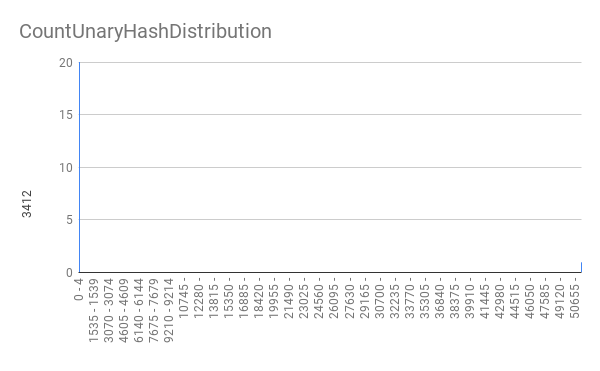
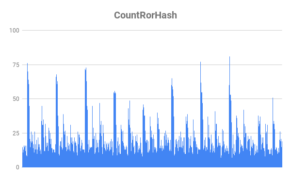
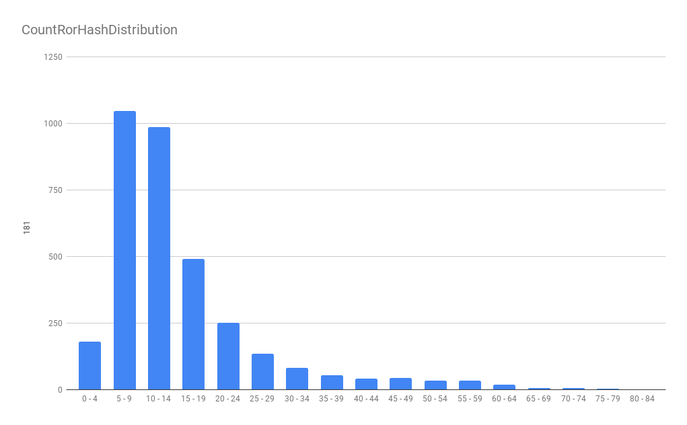
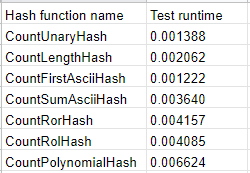

# Сравнение хеш функций

## Описание работы:

Сравнить несколько хеш функций по количеству коллизий и времени работы.

Сравнивались следующие функции:

1) Унарный хеш: всегда возвращает единицу

График распределения:

2) Хеш по длине: возвращает длину слова (на графике не показаны данные по всем бакетам чтобы лучше показать форму пика)

График распределения:

3) Хеш по первому ASCII коду: возвращает ASCII код первого символа (на графике не показаны данные по всем бакетам чтобы лучше показать форму пика)

График распределения:

4) Хеш по сумме ASCII кодов: возвращает сумму ASCII кодов символов

График распределения:

Первые 4 функции являются, можно сказать, псевдохешами, поскольку имеют очень много коллизий и не заполняют некоторые бакеты, что критично для хеш-таблицы.

5) Ror хеш: хеш, посчитаный с использованием команды ror

График распределения:

6) Rol хеш: хеш, посчитаный с использованием команды rol

График распределения:

Предыдущие 2 функции, казалось бы, крайне похожи, однако распределение у Rol хеша гораздо лучше, да и работает он быстрее. Связано это с тем, что при использовании Ror хеша мы куда чаще берём остаток от деления, ведь мы постоянно делаем циклическим сдвиг вправо, то есть у нас с высокой вероятностью старшие биты ненулевые, а потому число большое. Из-за этого увеличивается время работы и увеличивается кол-во коллизий. В этом плане Ror хеш полность проигрывает Rol хешу.

7) Полиноминальный хеш: обычный полиноминальный хеш

График распределения:

Полиноминальный хеш работает примерно в 1,5 раза дольше своего главного соперника - Rol хеша, но при этом распределение гораздо лучше, а показатель дисперсии в целых 2 раза меньше. Поэтому мы заключаем, что в данном сравнении наиболее выгодное положение имеет CountPolynomialHash, который мы и будем использовать в дальнейшем.

## Тесты по времени работы

## Дисперсия

