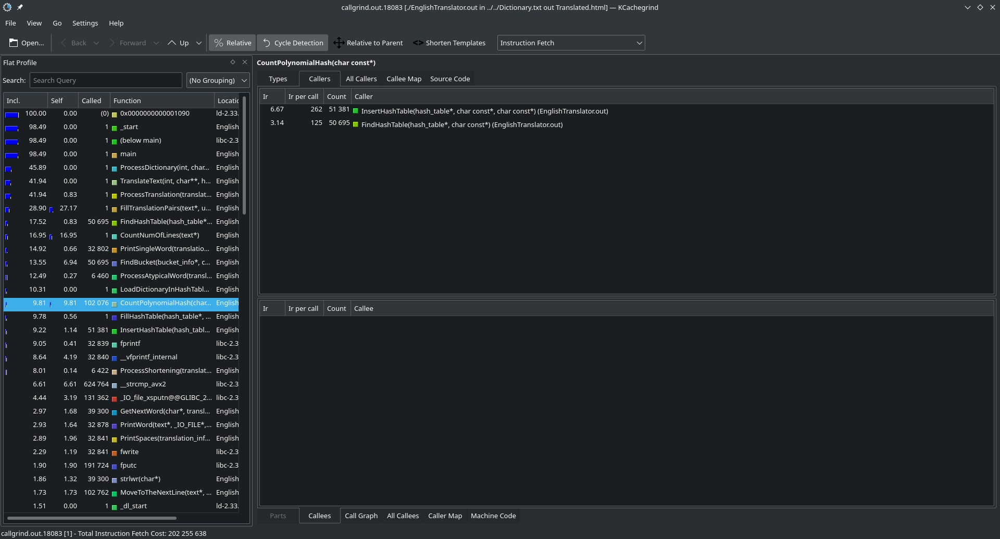
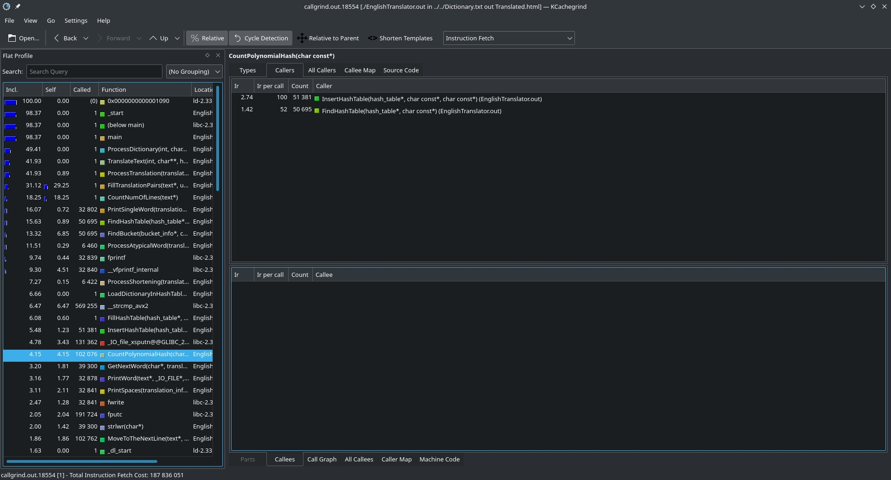
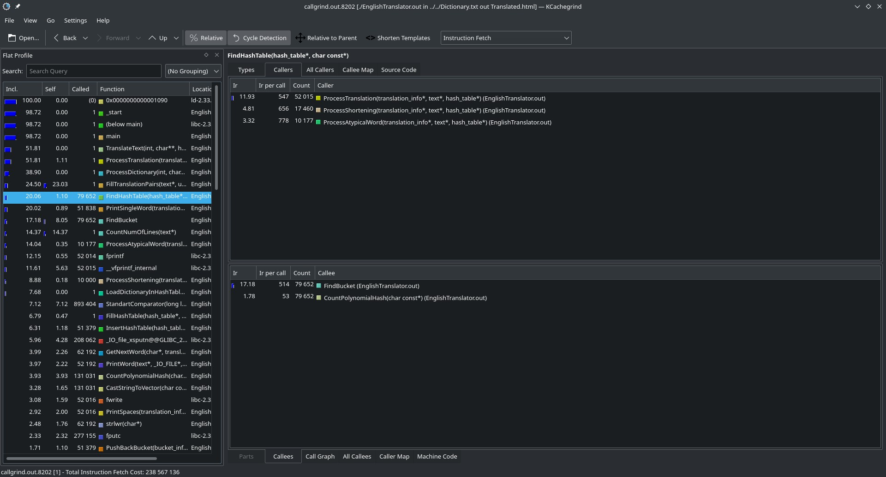
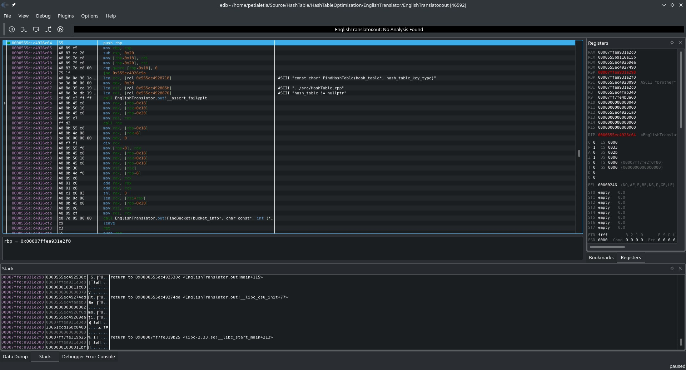
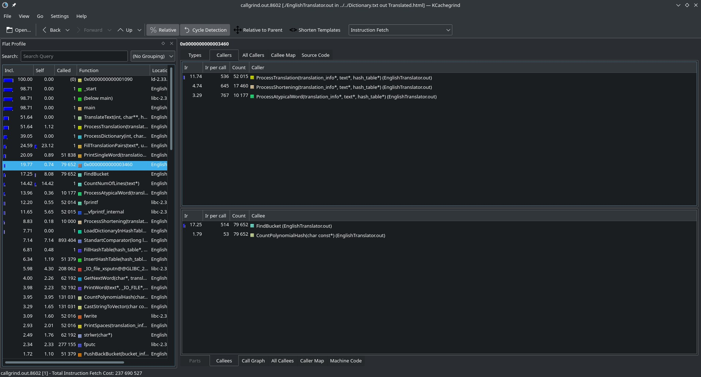
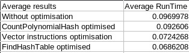

# Оптимизация хеш-таблицы

## Задача: взять за основу для этой части работы был взят переводчик. Необходимо было выбрать достаточно большой текст (в моём случае "Книга джунглей"), чтобы программа работала достаточно долго и мы могли собрать достоверную статистику по тому, какие функции больше всего замедляют программу. 

### ВАЖНО: передо мной стояла задача оптимизации работы именно хеш-таблицы, а не всего переводчика в целом, поэтому функции, которые работали долго, но не имели никакого отношению к хеш-таблице (к таким функциям, к примеру, относятся те, что отвечают за печать перевода), игнорировались.

Оптимизация прошла в 4 этапа:

0) Тестируем на скорость изначальную версию 

Замечаем, что одними из самых долгих функций является CountPolynomialHash и FindHashTable. Сперва я решил оптимизировать подсчёт хеша, поскольку к этой функции сводится почти любое взаимодействие с хеш-таблицей, в том числе и InsertHashTable.

1) Переписывание CountPolynomialHash на ассемблере в виде ассемблерной вставки

Вот как я переписал функцию хеширования;

Выхлоп от моих действий: -4,7% от времени работы

Прирост в скорости работы достаточно значителен. Теперь нам надо ускорить FindHashTable. Учитывая специфику нашей задачи, мы часто пользуемся поиском и почти не пользуемся вставкой, потому временем работы вставки можно немного пожертвовать во благо времени работы поиска. Сделать так можно используя векторные инструкции, мы будем хранить не указатель на массив символов, а вектор, который сравнивается с другим вектором за один такт. Конечно, вставлять вектор чуть менее приятно, чем указатель, поэтому пострадает время вставки, но зато время поиска уменьшится очень значительно

2) Переработка хеш-таблицы под хранение ключа в виде вектора типа __m256i. (-4,5% от времени работы)

Можно так же переписать сам FindHashTable. Если взглянуть на его вид в ассемблере, то можно заметить множество лишних обращений к стэку (оперативной памяти), перекладываний значений из регистров в регистры туда-сюда, чего можно избежать.

3) Переписывание FindHashTable на ассемблере в виде отдельного файла FindHashTable.asm

Вот как я переписал FindHashTable:

Выхлоп от моих действий: -0,3% от времени работы

Да, это немного, но это честная работа.

Вот как менялось общее время работы программы в ходе оптимизации:

В совокупности имеем прирост в скорости работы на 9,5%, что достаточно много, это не может не радовать.
