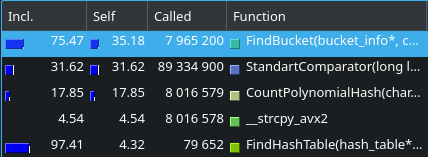

# Оптимизация хеш-таблицы

## Задача: взять за основу для этой части работы был взят переводчик. Необходимо было выбрать достаточно большой текст (в моём случае "Книга джунглей"), чтобы программа работала достаточно долго и мы могли собрать достоверную статистику по тому, какие функции больше всего замедляют программу. 

### ВАЖНО: передо мной стояла задача оптимизации работы именно хеш-таблицы, а не всего переводчика в целом, поэтому функции, которые работали долго, но не имели никакого отношению к хеш-таблице (к таким функциям, к примеру, относятся те, что отвечают за перевод), игнорировались, а все вызовы fprintf были закомментированы, чтобы они не занимали время.

Оптимизация прошла в 4 этапа:

0) Тестируем на скорость изначальную версию 


Замечаем, что одними из самых долгих функций является CountPolynomialHash.

1) Переписывание CountPolynomialHash на ассемблере в виде ассемблерной вставки

Вот как я переписал функцию хеширования;


Выхлоп от моих действий: -6,1% от времени работы CountPolynomialHash


Прирост в скорости работы достаточно значителен. Теперь нам надо бы ускорить FindBucket. Но, почти сразу за ней по времени работы идёт компаратор, который из себя представляет вызов strcmp. Было бы очень логично переписать хеш-таблицу на векторные инструкции, чтобы компаратор мог за 1 такт сравнить 2 слова, которые даны ему в виде 32-байтных векторов __m256i. Это сильно должно ускорить работу программы. Поскольку я всё равно собираюсь это сделать, первее переписывать FindBucket смысла не имеет, иначе потом придётся ещё раз переписывать FindBucket под работу с векторами.

2) Переработка хеш-таблицы под хранение ключа в виде вектора типа __m256i.



Есть незначительный прирост в скорости работы FindBucket, но очень сильно упала скорость компаратора, это означает, что его тоже надо будет обязательно переписать. Но пока FindBucket приоритетнее.

3) Переписывание FindBucket на ассемблере в виде отдельного файла FindBucket.asm:

```

global FindBucket
section .text

extern CastStringToVector

FindBucket:

    push r12
    push r13
    push r14

    mov r12, rdi       ; r12 = bucket pointer
    mov r14, rdx       ; r14 = Comparator

    mov rdi, rsi
    call CastStringToVector

    vmovdqa ymm2, ymm0 ; saving vector

    mov r13, [r12 + 8] ; r13 = size of bucket

    mov r12, [r12]     ; pointer to current node

FindBucketLoop:

    test r13, r13      ; check if list is ended

    jz NothingFound

    vmovdqa ymm0, [r12]
    vmovdqa ymm1, ymm2

    call r14           ; call Comparator

    cmp eax, -1
    je WordFound

    dec r13            ; reducing num of nodes remain in bucket
    add r12, 64        ; 64 is size of node in bucket

    jmp FindBucketLoop

WordFound: 

    add r12, 32
    mov rax, [r12]     ; rax = rus translation

    jmp FindBucketExit

NothingFound:

    xor rax, rax       ; rax = nullptr

FindBucketExit:

    pop r14
    pop r13
    pop r12

    ret

```


Имеем выхлоп в -4,6% от времени работы FindBucket

4) Переписываю компаратор в отдельном файле: 


Имеем с этого -8,15% от времени работы


Остальные функции, имеющие отношение к хеш-таблице, имеют менее 2,5% от времени работы программы, поэтому таких больших выигрышей от их оптимизации я не получу, значит самые медленные места в программе ускорены, а битсья за каждый процент от времени не имеет большого смысла, на это уйдёт тогда слишком много усилий по сравнению с тем выигрышем, который мы получим. Следовательно считаю процесс оптимизации завершённым. 
