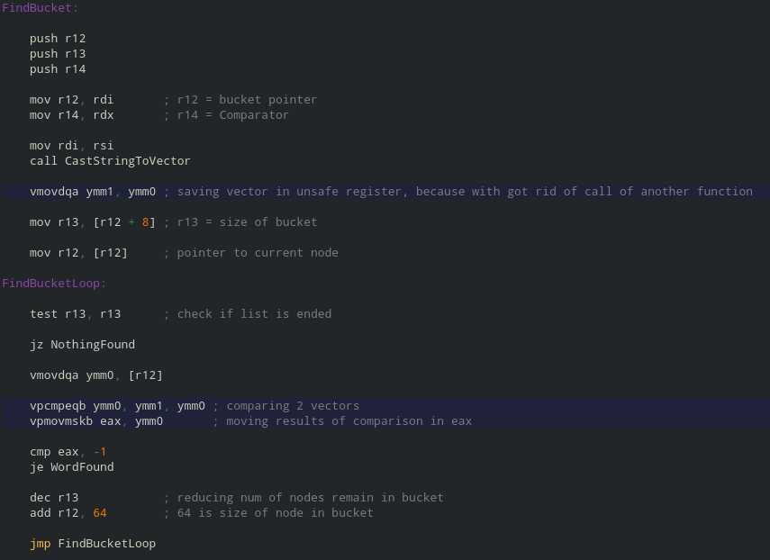

# Оптимизация хеш-таблицы

### Задача: взять за основу для этой части работы переводчик, выбрать достаточно большой текст (в моём случае "Книга джунглей"), чтобы программа работала достаточно долго и мы могли собрать достоверную статистику по тому, какие функции больше всего замедляют программу, после чего оптимизировать их.

### ВАЖНО: передо мной стояла задача оптимизации работы именно хеш-таблицы, а не всего переводчика в целом, поэтому функции, которые работали долго, но не имели никакого отношению к хеш-таблице (к таким функциям, к примеру, относятся те, что отвечают за перевод), игнорировались, а все вызовы fprintf были закомментированы, чтобы они не занимали время. А ещё, чтобы больше времени занимали функции, работающие с хеш-таблицей, поиск повторяется 100 раз (по одному и тому же сценарию), переводчик продолжит работать корректно, а вот обращений к таблице станет 100 крат больше.

Оптимизация прошла в 4 этапа:

0) Тестируем на скорость изначальную версию 


Замечаем, что самой долгой функцей является FindBucket. И сразу после неё по времени работы идёт компаратор, который из себя представляет вызов strcmp. Было бы очень логично переписать хеш-таблицу на векторные инструкции, чтобы компаратор мог за 1 такт сравнить 2 слова, которые даны ему в виде 32-байтных векторов __m256i. Это сильно должно ускорить работу программы. Поскольку я всё равно собираюсь это сделать, первее переписывать FindBucket смысла не имеет, иначе потом придётся ещё раз переписывать FindBucket под работу с векторами.

1) Переработка хеш-таблицы под хранение ключа в виде вектора типа __m256i.


|                                | Average runtime |
|--------------------------------|-----------------|
| BeforeOptimisation             |    1.0223664    |
| VectorInstructionsOptimisation |    1.0071754    |

#### Процентный рост скорости: 1,49 %

Время работы незначительно уменьшилось, одного этого точно не хватит, поэтому перепишем FindBucket

2) Переписывание FindBucket на ассемблере в виде отдельного файла FindBucket.asm:

```

global FindBucket
section .text

extern CastStringToVector

FindBucket:

    push r12
    push r13
    push r14

    mov r12, rdi       ; r12 = bucket pointer
    mov r14, rdx       ; r14 = Comparator

    mov rdi, rsi
    call CastStringToVector

    vmovdqa ymm2, ymm0 ; saving vector

    mov r13, [r12 + 8] ; r13 = size of bucket

    mov r12, [r12]     ; pointer to current node

FindBucketLoop:

    test r13, r13      ; check if list is ended

    jz NothingFound

    vmovdqa ymm0, [r12]
    vmovdqa ymm1, ymm2

    call r14           ; call Comparator

    cmp eax, -1
    je WordFound

    dec r13            ; reducing num of nodes remain in bucket
    add r12, 64        ; 64 is size of node in bucket

    jmp FindBucketLoop

WordFound: 

    add r12, 32
    mov rax, [r12]     ; rax = rus translation

    jmp FindBucketExit

NothingFound:

    xor rax, rax       ; rax = nullptr

FindBucketExit:

    pop r14
    pop r13
    pop r12

    ret

```


|                                | Average runtime |
|--------------------------------|-----------------|
| VectorInstructionsOptimisation |    1.0071754    |
| FindBucketOptimised            |    0.8510366    |

#### Процентный рост скорости: 15,5 %

Имеем достаточно значительное увеличение производительности. Уже неплохо. Теперь перепишем компаратор

3) Переписываю компаратор в отдельном файле: 


|                                | Average runtime |
|--------------------------------|-----------------|
| FindBucketOptimised            |    0.8510366    |
| StandartComparatorOptimised    |    0.5281352    |

#### Процентный рост скорости: 37,94 %


Поскольку компаратор часто вызывается, имеет смысл "заинлайнить" его внутри функции FindBucket

4) Инлайним StandartComparator:



|                                | Average runtime |
|--------------------------------|-----------------|
| StandartComparatorOptimised    |    0.5281352    |
| ComparatorInligned             |    0.4290328    |

#### Процентный рост скорости: 18,76 %

Имеем значительный выхлоп только за счёт того, что избавились от многократных вызовов небольшой функции.


Следующая функция на очереди CountPolynomialHash

5) Переписывание CountPolynomialHash на ассемблере в виде ассемблерной вставки

Вот как я переписал функцию хеширования;


|                                | Average runtime |
|--------------------------------|-----------------|
| ComparatorInligned             |    0.4290328    |
| CountPolynomialHashOptimised   |    0.3381752    |

#### Процентный рост скорости: 21,18 %


Следующая функция это FindHashTable, однако уже сейчас видно, что она занимает достаточно мало времени в процентном отношении, поэтому вряд ли её переписывание даст значительный прирост, но ради чистоты эксперимента мы пойдём на это.

6) Переписывание FindHashTable на ассемблере

Вот её код на асме

```

global FindHashTable
section .text

extern FindBucket

FindHashTable:

    push r12
    push r13
    push r14
    mov r12, rdi          ;r12 = hash_table pointer  
    mov r13, rsi          ;r13 = key

    mov r14, 100          ;r14 = num_of_repeat
    
FindHashTableLoop:

    test r14, r14
    jz FindHashTableExit
    
    mov rdi, r13          ;rdi = key
    mov rsi, [r12 + 2 * 8];rsi = CountHash

    call rsi

    xor rdx, rdx          ;needed for division
    mov rsi, [r12 + 8]    ;rsi = length_of_hash_table

    div rsi

    mov rdi, [r12]        ;rdi = columns pointer

    mov rax, rdx          ;rdx = 3 * rdx (3 == num of 8-byte fields in node)
    add rdx, rdx          
    add rdx, rax

    shl rdx, 3            ;rdx = 8 * rdx
    add rdi, rdx          ;rdi = needed column pointer

    mov rsi, r13          ;rsi = key

    call FindBucket
    
    dec r14
    jmp FindHashTableLoop

FindHashTableExit:
    
    pop r14
    pop r13
    pop r12
    ret
    
```

|                                | Average runtime |
|--------------------------------|-----------------|
| CountPolynomialHashOptimised   |    0.3381752    |
| FindHashTableOptimised         |    0.3367566    |

#### Процентный рост скорости: 0,42 %


Функция теперь занимает меньше времени в процентном отношении, однако на деле ускорение едва ли ощутимо, мы выиграли всего 0,4%. Поэтому заключаем, что дальняйшая оптимизация не имеет особого смысла, мы потратим непропорционально много усилий на то, чтобы получить околонулевой выигрыш.

Итого мы ускорили функцию на 67% от исходного времени. Мои усилия того стоили.
