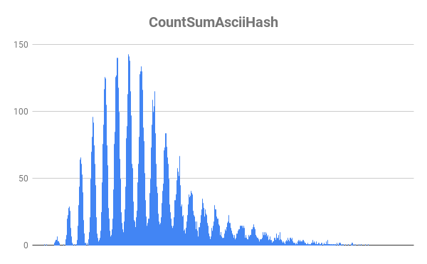

> First of all:

>> Всем, кто разумеет, что написано в этом предложении, советую читать ридми в оригинале, т.е. на русском языке, см. RusReadMe.md 

> Second of all:

>> Pardon my English

# Hash-table

This task consists of 3 pats:

1) Comparison of hash functions

2) English translator 

3) Hash-table optimisation 

This is general ReadMe, you can find personal ReadMe abouth each subtask in folder for it. 

The main goal of this task is to learn how to work with hash-table, apply it in real programm and optimize it with all knowledge I got during semester

## Comparison of hash functions

### Task: study hash functions for there effectivity: num of collisions and runtime

Functions, which were compared:

1) Unary hash: always returns 1

2) Length hash: returns length of word

3) First ASCII hash: returns ASCII code of first symbol in word

4) Sum ASCII hash: returns sum of ASCII codes of symbols in word

5) Ror hash: hash, calculated with ror command

6) Rol hash: hash, calculated with rol command

7) Polynomial hash: casual polynomial hash

The winner, predictably, was the polynomial hash.

Tablets with results and graphics are attached

#### Runtime tests

#### Dispersion

#### Distribution graphics

Graphic with comparison of 3 best hash functions (blue - ror hash, orange - rol hash, grey - polynomial hash)

Extra info and details in ReadMe in folder ComparisonOfHashFunctions

## English translator

### Task: apply hash-table and create translator, using dictionary 

Programm analyses text in Text.txt and creates file Translated.html, which can be opened in browser. You should aim cursor on confusing word, and you will get russian translation, if it existes in dictionary, or else you will get "ERROR".

Programm tends to translate almost all words, except for proper nouns and word forms like "happier", which isn't just like "happy" you can find in dictionary. You can find details about how does translator work in ReadMe in folder EnglishTranslator.

## Hash-table optimisation

### Task: this task based on english translator. It was needed to pick big enough text ("The Jungle Book" in my case) for programm work long enough so we could collect statistics about functions, which make programm work slow. 

#### Importantly: it was needed to optimize the work of hash-table but not translator as a whole, so I ignored functions, which worked long, but wasn't connected with hash-table (those, for example, functions, which write translation in file).

The longest functions of hash-table were CountHash and FindHashTable, they were needed to be reworked. Optimisation go through in 4 steps:

0) Testing start version of translator

1) Rewriting CountPolynomialHash on assembler with help of assembler insertion (-4,7% of runtime)

2) Conversion of hash-table for keeping key in vector type __m256i (-4,5% of runtime)

3) Rewriting FindHashTable on assembler in separate file FindHashTable.asm (-0,3% of runtime)

As a whole, we got 9,5% speed increas, it's big enough. 

You can see more details in ReadMe in folder HashTableOptimisation
