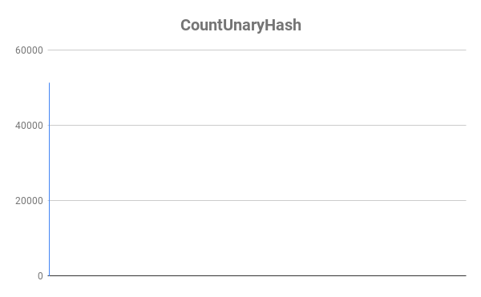
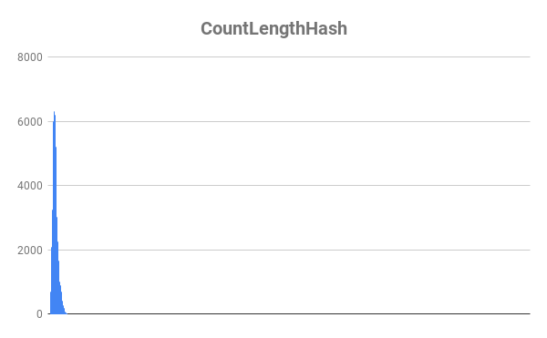
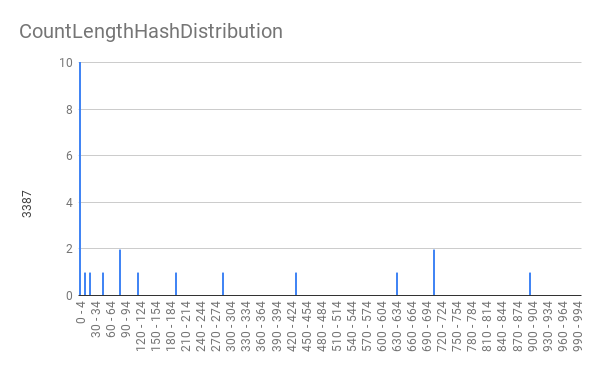
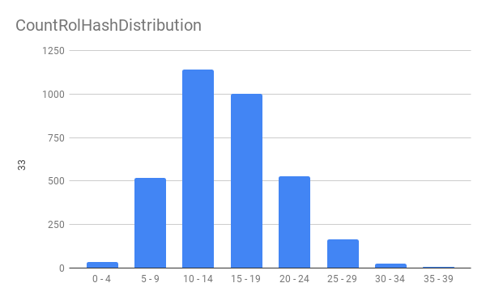
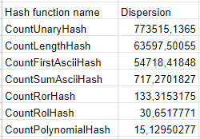
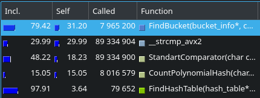
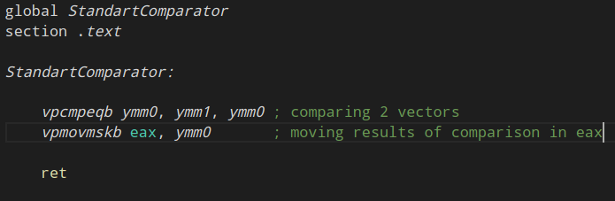
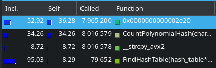
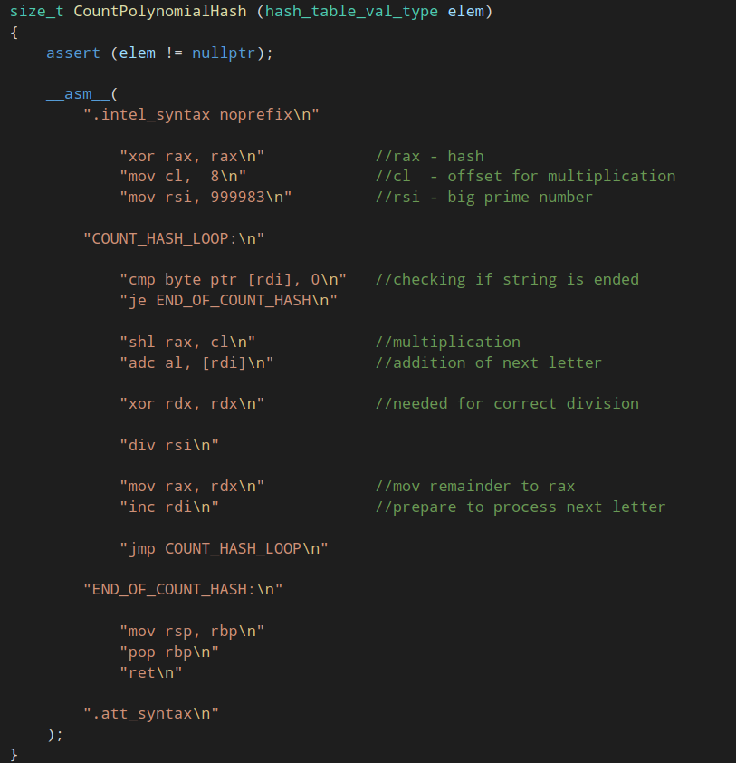

> [Original russian version](RusReadMe.md)

# Hash-table

This task consists of 3 pats:

1) [Comparison of hash functions](#comparison-of-hash-functions)

2) [English translator](#english-translator) 

3) [Hash-table optimisation](#hash-table-optimisation) 

The main goal of this task is to learn how to work with hash-table, apply it in real programm and optimize with all my knowledge of assembler

# Comparison of hash functions

### Task: study hash functions for there effectivity: num of collisions and runtime

Functions, which were compared:

1) Unary hash: always returns 1



Distribution graphic:


Graphic was zoomed in for little spike in right edge to be observed.

2) Length hash: returns length of word


Distribution graphic:


Graphic was zoomed in for little spikes to be observed.

3) First ASCII hash: returns ASCII code of first symbol in word



Distribution graphic:



Graphic was zoomed in for little spikes to be observed.

4) Sum ASCII hash: returns sum of ASCII codes of symbols in word


Distribution graphic:


First 4 functions is, shall we say, pseudo hashes, because they have a lot of collisions and do not fill all buckets, it is very critical for hash-table.

5) Ror hash: hash, calculated with ror command


Distribution graphic:


6) Rol hash: hash, calculated with rol command


Distribution graphic:



Previous 2 functions were seemingly almost just the same, but distribution of Rol hash function is a lot better, in addition it works faster


This is due to the fact in Ror hash we take the remainder a lot more frequently, because rotating to the right makes high bits positive, so the hash is bigger than the length of hash-table with hish probability. That's why the runtime is bigger and distribution is worse. So here Ror hash totelly lose to Rol one.

7) Polynomial hash: casual polynomial hash


Distribution graphic:


Polynomial hash is approximately 1,5 times longer than Rol hash, but the distribution is a lot better, the dispersion is 2 times lesser. So I conclude that CountPolynomialHash is the ultimate winner in comparison of those functions. So I will use it futher on.

## Runtime tests


## Dispersion



# English translator

### Task: apply hash-table and create translator, using dictionary 

Programm analyses text in Text.txt and creates file Translated.html, which can be opened in browser. You should aim cursor on confusing word, and you will get russian translation, if it existes in dictionary, or else you will get "ERROR".

Programm tends to translate almost all words, except for proper nouns and word forms like "happier", which isn't just like "happy" you can find in dictionary. You can find details about how does translator work in ReadMe in folder EnglishTranslator.

### Programm description:

1) Processing word, trying to find in dictionary.

2) Processing word with the next word, trying ro find combination of them in dictionary, if programm finds it, translation to those words will be written.

3) Forgetting next word and trying to shorten current word, firstly by 1 letter, secondly - by 2. It makes translation of such words as "faster", "does" and "learned" possible. But there are some word forms, which can't be translated by my programm, like "happier", or can be translated incorrectly, for example "begun" will be shorted to "beg" and translated incorrectly. There is nothing I can do with this if I do not want to overcomplicate this task, main point was to work with hash-table, not to create perfect translator.

So there is processing of current line length, so lines won't be too long. Shift to the next line is perfomed correctly, even if there wasn't shift in original text.

# Hash-table optimisation

### Task: this task based on english translator. It was needed to pick big enough text ("The Jungle Book" in my case) for programm work long enough so we could collect statistics about functions, which make programm work slow. 

#### Importantly: it was needed to optimize the work of hash-table but not translator as a whole, so I ignored functions, which worked long, but wasn't connected with hash-table (those, for example, functions, which processing translation), also with the same purpose I commented calls of "fprinf" and made every FindHashTable to do it's job 100 times, translation will be just the same, but hash-table functions will be called 100 times bigger num of times.

Optimisation went through in 6 steps:

0) Testing start version of translator



I noticed, the longest function is FindBucket and after it is StandartComparator, which is just call of strcmp. I think it makes sense to rewrite hash-table for storing 32-byte vector __m256i instead of char*, so comparator could compare them in 1 clock. It will make my programm work faster. So, as far as I want to do it, there is no point in making rewriting FindBucket first thing to do, otherwise I will be forced to rewrite it again for it to correctly work with vectors.

1) Conversion of hash-table for storing key in vector type __m256i

Change of runtime:

|                                | Average runtime |
|--------------------------------|-----------------|
| BeforeOptimisation             |    1.0223664    |
| VectorInstructionsOptimisation |    1.0071754    |

#### Percentage speed increase: 1,49 %


Runtime is lightly less, so this not even close to ve enough, let's rewrite FindBucket

2) Rewriting FindBucket on assembler in separate file FindBucket.asm:

```

global FindBucket
section .text

extern CastStringToVector

FindBucket:

    push r12
    push r13
    push r14

    mov r12, rdi       ; r12 = bucket pointer
    mov r14, rdx       ; r14 = Comparator

    mov rdi, rsi
    call CastStringToVector

    vmovdqa ymm2, ymm0 ; saving vector

    mov r13, [r12 + 8] ; r13 = size of bucket

    mov r12, [r12]     ; pointer to current node

FindBucketLoop:

    test r13, r13      ; check if list is ended

    jz NothingFound

    vmovdqa ymm0, [r12]
    vmovdqa ymm1, ymm2

    call r14           ; call Comparator

    cmp eax, -1
    je WordFound

    dec r13            ; reducing num of nodes remain in bucket
    add r12, 64        ; 64 is size of node in bucket

    jmp FindBucketLoop

WordFound: 

    add r12, 32
    mov rax, [r12]     ; rax = rus translation

    jmp FindBucketExit

NothingFound:

    xor rax, rax       ; rax = nullptr

FindBucketExit:

    pop r14
    pop r13
    pop r12

    ret

```

Change of runtime:

|                                | Average runtime |
|--------------------------------|-----------------|
| VectorInstructionsOptimisation |    1.0071754    |
| FindBucketOptimised            |    0.8510366    |

#### Percentage speed increase: 15,5 %

There is significant increase. Not bad, not bad at all.


Here function 0x0000000000002e20 is FindBucket

Let's rewrite comparator

3) Rewriting comparator in separate file: 



Change of runtime:

|                                | Average runtime |
|--------------------------------|-----------------|
| FindBucketOptimised            |    0.8510366    |
| StandartComparatorOptimised    |    0.5281352    |

#### Percentage speed increase: 37,94 %


Here function 0x0000000000002e20 is StandartComparator, 0x0000000000002dc0 - FindBucket

Comparator is frequently called from FindBucket, so it makes sense to "inline" it

4) "Inlining" StandartComparator:

The piece of code is attached, the lines, which were changed, are in blue.


Change of runtime:

|                                | Average runtime |
|--------------------------------|-----------------|
| StandartComparatorOptimised    |    0.5281352    |
| ComparatorInligned             |    0.4290328    |

#### Percentage speed increase: 18,76 %

I had a significant increase just because there weren't repeatedly called small function.



Here function 0x0000000000002e20 is FindBucket

Next to be optimised will be CountPolynomialHash

5) Rewriting CountPolynomialHash on assembler with help of assembler insertion

That's how i rewrote CountPolynomialHash;



Change of runtime:

|                                | Average runtime |
|--------------------------------|-----------------|
| ComparatorInligned             |    0.4290328    |
| CountPolynomialHashOptimised   |    0.3381752    |

#### Percentage speed increase: 21,18 %


Here function 0x0000000000002de0 is FindBucket

Next function to be optimised if FindHashTable, but is already obvious, that it takes not that much time, so we won't have big increase out of rewriting it, nevertheless, for purity of experiment, I have done this.

6) Rewriting FindHashTable in separate file

Here is the code on asm

```

global FindHashTable
section .text

extern FindBucket

FindHashTable:

    push r12
    push r13
    push r14
    mov r12, rdi          ;r12 = hash_table pointer  
    mov r13, rsi          ;r13 = key

    mov r14, 100          ;r14 = num_of_repeat
    
FindHashTableLoop:

    test r14, r14
    jz FindHashTableExit
    
    mov rdi, r13          ;rdi = key
    mov rsi, [r12 + 2 * 8];rsi = CountHash

    call rsi

    xor rdx, rdx          ;needed for division
    mov rsi, [r12 + 8]    ;rsi = length_of_hash_table

    div rsi

    mov rdi, [r12]        ;rdi = columns pointer

    mov rax, rdx          ;rdx = 3 * rdx (3 == num of 8-byte fields in node)
    add rdx, rdx          
    add rdx, rax

    shl rdx, 3            ;rdx = 8 * rdx
    add rdi, rdx          ;rdi = needed column pointer

    mov rsi, r13          ;rsi = key

    call FindBucket
    
    dec r14
    jmp FindHashTableLoop

FindHashTableExit:
    
    pop r14
    pop r13
    pop r12
    ret
    
```

Change of runtime:

|                                | Average runtime |
|--------------------------------|-----------------|
| CountPolynomialHashOptimised   |    0.3381752    |
| FindHashTableOptimised         |    0.3367566    |

#### Percentage speed increase: 0,42 %


Here function 0x0000000000002d50 is FindBucket, 0x0000000000002db0 - FindHashTable

Function runtime is reduced. But the speed increase hardly noticeably, I won only 0,42 %. So I conclude that futher optimisation is almost pointless, I won't get significant outcome out of it. Optimisation is completed.

Totaly I increased the speed of programm on 67 %. So I think my time was worth it.
