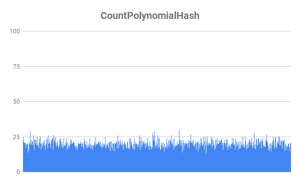

# Хеш-таблица

Это задача поделена на 3 части:

1) Сравнение хеш функций

2) Переводчик с английского

3) Оптимизация хеш-таблицы

Под каждую из подзадач создана отдельная папка, эта ридмишка общая для трёх, в папках лежат более подробные ридмишки под каждую из задач. 

Основной задачей работы было знакомство с хеш-таблицей, применение её в реальной программе и оптимизация с момощью знаний, полученных в ходе семестра.

## Сравнение хеш функций

### Задача: изучить различные функции хеширования на предмет эффективности, т.е. равномерности заполнения таблицы и скорости работы.

Поскольку средняя заселённость не влияет на время работы функций, тесты были проведены для фиксированной - в 15 элементов

Сравнивались следующие функции:

1) Унарный хеш: всегда возвращает единицу

2) Хеш по длине: возвращает длину слова

3) Хеш по первому ASCII коду: возвращает ASCII код первого символа

4) Хеш по сумме ASCII кодов: возвращает сумму ASCII кодов символов

5) Ror хеш: хеш, посчитаный с использованием команды ror

6) Rol хеш: хеш, посчитаный с использованием команды rol

7) Полиноминальный хеш: обычный полиноминальный хеш

Победителем, ожидаемо, вышел полиноминальный хеш, как тот, что имеет самую малую дисперсию, при этом не так сильно замедляя работу программы.

Прилагаю таблици с результатами и графики распределений.

#### Тесты по времени работы

#### Дисперсия

#### Графики распределений

Больше подробностей в ридми в папке ComparisonOfHashFunctions

## Переводчик с английского

### Задача: воспользоваться хеш-таблицей на практике, создав переводчик текстов на основе словаря. 

Программа анализирует текс из Text.txt и создаёт файл Translated.html, который можно открыть в браузере. При наведении на слово, если оно было переводо, будет высвечена вырезка из переводчика, иначе будет выведено сообщение "ERROR". 

Как правило, программа не может перевести только имена собственные, словоформы, достаточно похожие на начальную форму, программа тоже переводит, хотя вот слова наподобие "happier" перевести ей не под силу. Полный список применяемых приёмов при переводе смотри в ридми в папке EnglishTranslator.

## Оптимизация хеш-таблицы

### Задача: взять за основу для этой части работы был взят переводчик. Необходимо было выбрать достаточно большой текст (в моём случае "Книга джунглей"), чтобы программа работала достаточно долго и мы могли собрать достоверную статистику по тому, какие функции больше всего замедляют программу. 

#### ВАЖНО: передо мной стояла задача оптимизации работы именно хеш-таблицы, а не всего переводчика в целом, поэтому функции, которые работали долго, но не имели никакого отношению к хеш-таблице (к таким функциям, к примеру, относятся те, что отвечают за печать перевода), игнорировались.

Самыми долгими функциями хеш-таблицы были CountHash и FindHashTable. их необходимо было переработать. Оптимизация прошла в 4 этапа:

0) Тестируем на скорость изначальную версию

1) Переписывание CountPolynomialHash на ассемблере в виде ассемблерной вставки (-4,7% от времени работы)

2) Переработка хеш-таблицы под хранение ключа в виде вектора типа __m256i. (-4,5% от времени работы)

3) Переписывание FindHashTable на ассемблере в виде отдельного файла FindHashTable.asm (-0,3% от времени работы)

В совокупности имеем прирост в скорости работы на 9,5%, что достаточно много, это не может не радовать.

Больше подробностей в ридми в папке HashTableOptimisation

## Заключение

В ходе данной работы я написал свою первую хеш-таблицу, сделал достаточно полезную прогу и оптимизировал её работу, применив знания ассемблера и векторных инструкций. Я считаю, что данная работа была очень полезна для меня. Всем советую.
